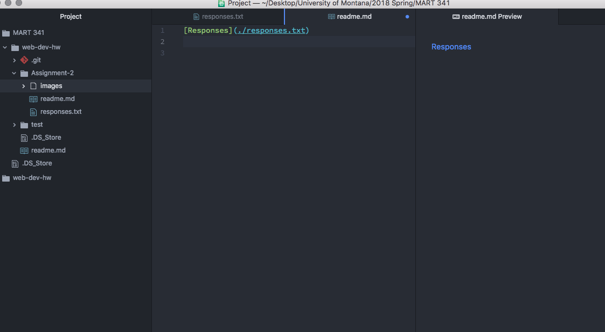

## Assignment 2
***
B) Version control is a method of file storage, where you can use a program such as Github Desktop to upload different versions of your repository to the internet. This allows you to go back through and load previous versions that have been uploaded if you want to step backwards in the process.

C) My work cycle this week consisted of the following: watching and reading through the material on the course website for module two, creating a repository on my Github account and linking it to my desktop, completing the response questions, taking screenshots, linking locally, and creating this readme.md file.

[Responses](./responses.txt)

