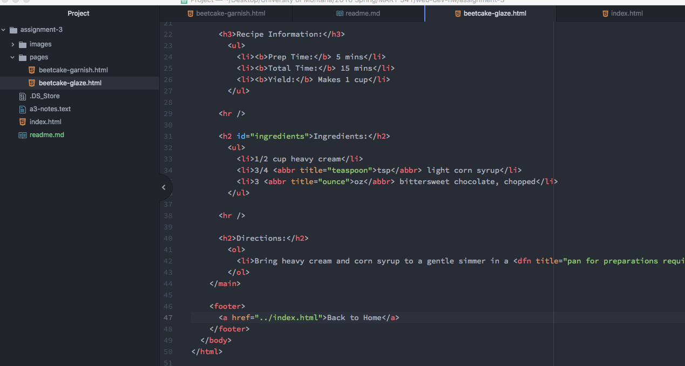

# Assignment 3 Readme

### Head and Body Elements
There can only be one head and one body element for each document. The head element provides information behind the scenes about the website. This can include the author, title, and character set. The webpage user does not see this information. The body element provides the meat of the website, and all of the visible content.

### Structural and Semantic Markup
Structural markup is used to define structural elements within the webpage, such as headings, paragraphs, lists, and line breaks. This content helps guide the user and is also used by the browser to understand the content. Semantic markup is used to help define meaning of the content of the document. This includes quotations, bolding or italicizing words, defining meaning, or providing general emphasis on a word or phrase.

### Work Cycle
This week I read all of the content off of the website, and then went through the assignment, following the hw directions found on moodle, and step by step completed the assignment. I didn't take any creative liberty with the content because it seems to me that we have to follow the assignment to a tee. I did not post anything on the issues board because I was able to complete everything myself.

