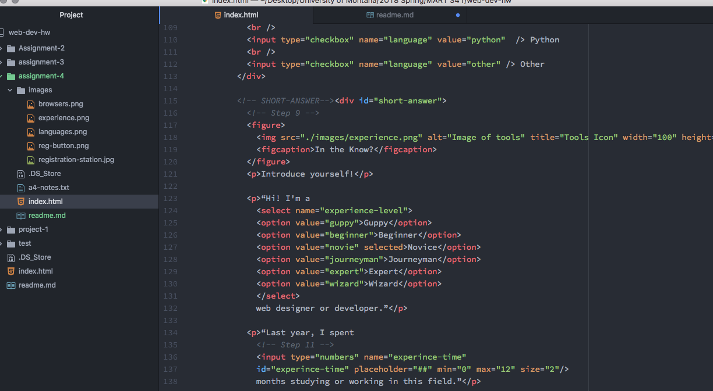

# Assignment 4 Readme

The alt tag is used by alternative browsers, such as those for the visually impaired, as well as if the primary title has a problem with it or can't be read.
I have come across all kinds of forms while browsing the web, such as images, tables, and various menus. These forms serve a multitude of purposes, such as making the website more interactive and providing visual aberrations.
My work cycle for this week was very streamlined. I watched and read the content on the website and then followed along with the steps to complete my homework. I didn't need to consult the issue board or use my classmates for help.

