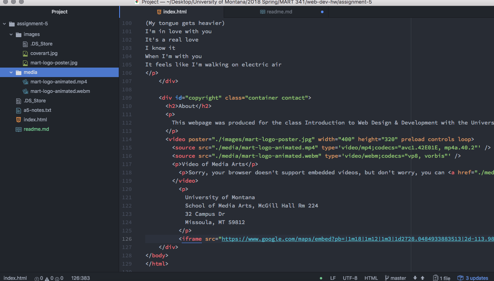

# Assignment 5 Readme

IDs are identifiers that are unique from other IDs on the page. This helps keep elements separate from each other. Classes group similar elements together. Divs are a large block that divide the page up into groups of elements. Spans group elements within the div tag.

The reason to use third party sourcing is because it allows you to take up less space and allows for better quality media, both audio and video, and smoother playback.

This assignment was difficult for me, particularly getting the audio and video to embed. This is because I somehow missed the part where we need to use an embedded link when reading over the website material, and so I spend a long time troubleshooting why my links weren't working when it was in fact this simple fix. Incredibly frustrating. However I did enjoy the creative element of this week. I used the issues board to post about my problem and one of my classmates solved it for me, helping me out immensely.

Here is a screenshot.

