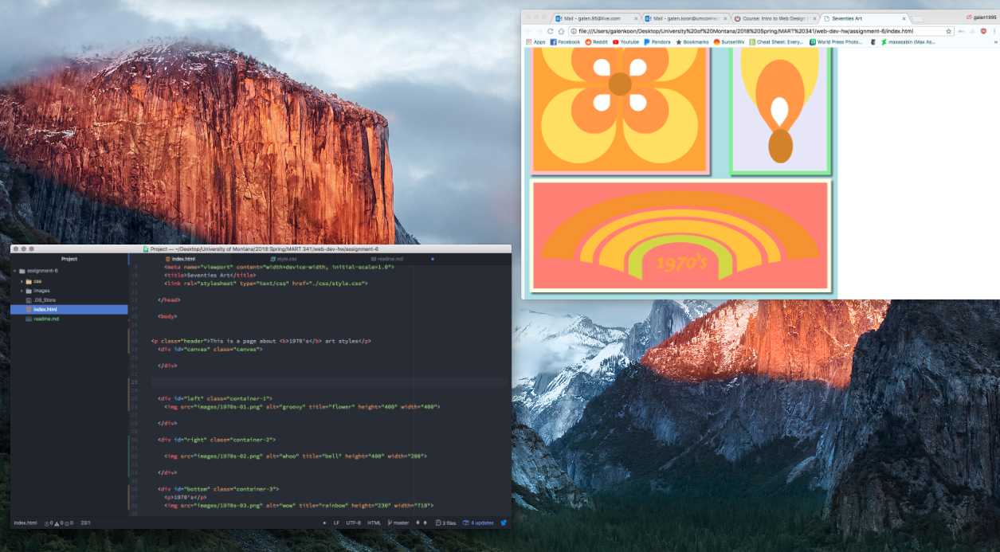

# Readme for Assignment 6

### Styling
I decided to go with a 1970's theme for my webpage, because I really enjoy the styles of the time and the
color pallete presented in the designs. I tried to style my page using large blocks of color, from the same color pallete, in a simple design that lets the colors and shapes speak for themselves.

### Colors
I chose orange, lightyellow, and salmon for my color pallete, with the addition of powderblue as the background color. There are other colors present as well to accent, but the 3 main colors are current throughout.

### Work Cycle
For this week, I was able to complete my assingment by using the website, some videos I found online, as well as the help of Jordan Costello in her office. She was able to help me with positioning, because it was something I was struggling with. Overall, I really liked this week because we focused more on the aesthetic.

