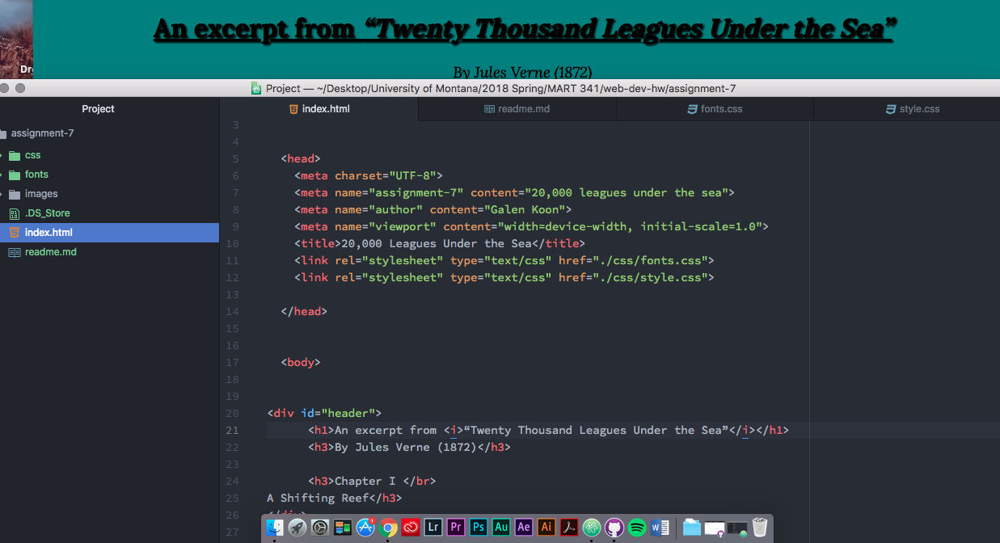

# Readme for Assignment 7

### Font Choice

I chose to use the Lora font family for my headings and my button, and the IM Fell Great Primer font family for my body paragraphs. I chose these because I feel they reflect an old-timey (this book was written in 1872) feel, as well as a nautical theme. I could totally picture someone writing in an old captains log on a ship in this handwriting. I wanted my color pallete to be simple, and so I used a teal for the background, which reflects the ocean, and black for the text.

System fonts are those fonts that are specific to your machine, and already downloaded and ready to use. These might not be available to use for the web due to licencing issues. Web fonts are fonts that are hosted by a third-party server, which will show up on your computer but may need special instructions to be able to use. Web-safe fonts are developed with the intention of wide range usage on both systems and the web. It is important to have a font stack because if someone is trying to view your website and their system isn't capable of loading one of your fonts, the fallback font will be used as a broader application.

My work cycle for this week consisted of me reading and following along with the information on the website, and then creating my page. I used Google fonts to find my fonts.

