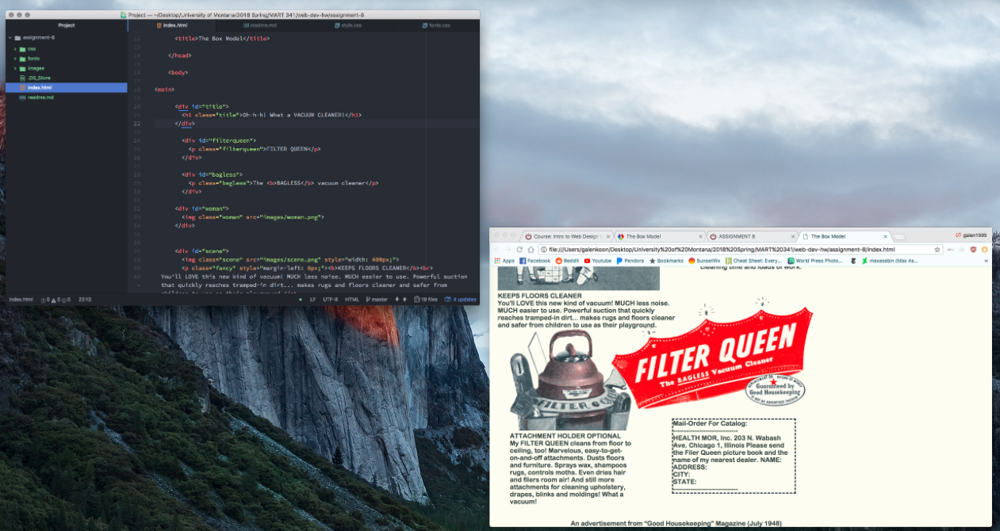

# Assignment 8 Readme

Padding is the filler space that surrounds between the content and the border of the element, margin is the space between the element's border and other elements, and a border is a designated px space that surrounds the edge of the element.

The hardest thing for me to accomplish this assignment was the layout and the nesting of elements using ids and classes. Understanding the difference between the two is very confusing and I struggled to organize my code because of that.

For this assignment I utilized the website and all of the materials there, and then went into Justine's office and received help from her. I also looked at my classmates' code for ideas and help.

