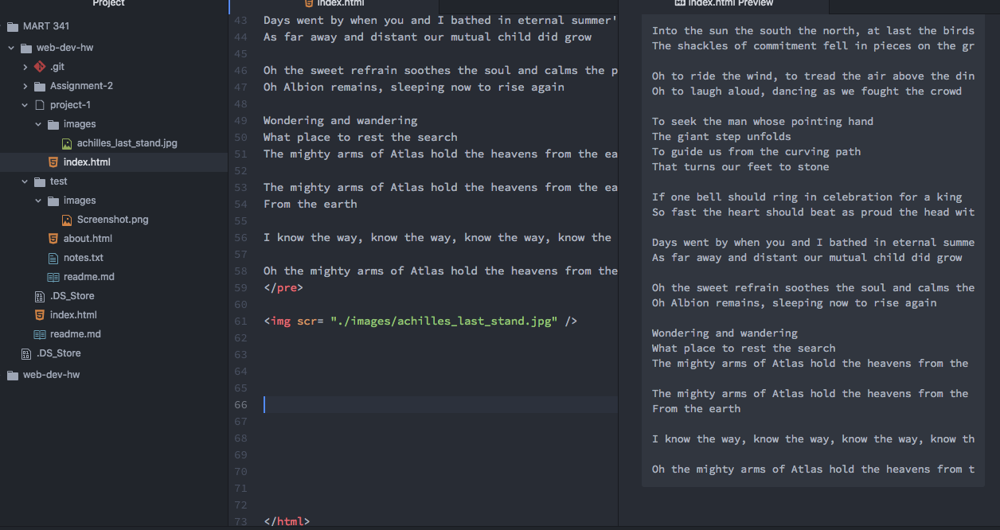

# Project 1 readme.md

1) I have been using Google Chrome for my web development. Chrome is a browser that works by interpreting source files that are provided by a server. The creator uploads the files to the server, which is then accessed by the browser. The browser is equipped with engines that are able to interpret the html or css files and then project them onto the webpage.

2) I visited www.geocities.com which is from 1997. This website looks vastly different than modern sites. All of the links are blue text hyperlink format, which in modern sites would look very tacky. There is a lot of blank space as well, with no background images taking up space. The format is also centered on the left side of the image, I'm guessing in order to conform toward smaller screens. Modern webpages are much more streamlined and smoother looking, with embedded images and videos that add to the sensory experience.

3) My work cycle this week was not the most streamlined. I watched all of the content and went a long with the practice files provided on the website, which was fine, but then I struggled when creating my actual project due to a syntax error. I was spelling src as scr, which was a huge hold up in my process. I posted an issue on the issues board, as well as sent an email to my professor. I also went to the BA Media Arts lab in McGill, which ended up solving my problem. I chose to do the song "Achilles Last Stand" by _Led Zeppelin_, which is one of my favorite songs of all time. I chose an image of Achilles that I thought provided the emotion that I feel the song produces.

4) 
