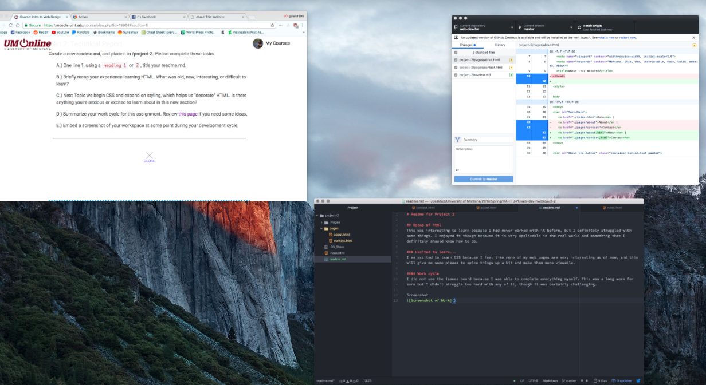

# Readme for Project 2

## Recap of html
This was interesting to learn because I had never worked with it before, but I definitely struggled with some things. I enjoyed it though because it is very applicable in the real world and something that I definitely should know how to do.

### Excited to learn...
I am excited to learn CSS because I feel like none of my web pages are very interesting as of now, and this will give me some pizazz to spice things up a bit and make them more viewable.

#### Work cycle
I did not use the issues board because I was able to complete everything myself. This was a long week for sure but I didn't struggle too hard with any of it, though it was certainly challenging.

Screenshot

